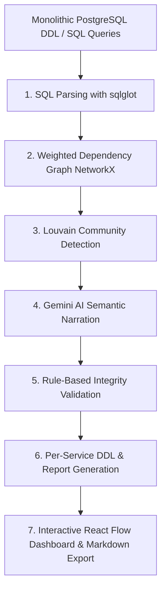

# SchemaMorph AI

> **Intelligent Monolith-to-Microservices Database Decomposition Platform**  
> Analyze monolithic PostgreSQL schemas and discover natural, production-ready microservice boundaries using deterministic graph algorithms and Google Gemini AI.

---

## 🌟 Overview

**SchemaMorph AI** addresses one of the hardest problems in software engineering: safely decomposing legacy monolithic databases into clean, independently deployable microservice schemas. 

Instead of relying solely on black-box LLM hallucinations or rigid manual heuristics, SchemaMorph AI uses a **hybrid, deterministic-first architecture**:
1. **Mathematical Partitioning**: Uses `sqlglot` + `NetworkX` + **Louvain Community Detection** to group database tables based on foreign key relationships and query co-access weights.
2. **AI Narration & Strategic Insights**: Google Gemini AI inspects the deterministic clusters to provide semantic domain naming, design rationale, API boundary recommendations, and broken query mitigations.
3. **Comprehensive Validation Engine**: Automatically verifies partition consistency, cycles, orphaned tables, and foreign-key integrity constraints.

---

## 🚀 Key Features

- 🧩 **Deterministic Graph Clustering**: Foreign key dependencies (weighted 2×) and query co-access patterns (weighted 1×) are modeled as a weighted graph and partitioned via the Louvain modularity algorithm (`random_state=42` for 100% reproducibility).
- 🤖 **AI-Powered Narration**: Gemini AI explains *why* each service exists, generates architectural summaries, and flags queries that cross service boundaries.
- 🛡️ **Zero-Hallucination Integrity Checks**: An independent rule-based validator inspects partition completeness, orphan tables, FK crossings, and cyclic dependencies before generating final outputs.
- 📜 **Per-Service DDL Generation**: Exports clean, isolated, ready-to-deploy SQL schemas for each proposed microservice with foreign keys cleanly decoupled.
- 🕸️ **Interactive React Flow Visualization**: Color-coded, draggable graph visualization with Dagre auto-layout, interactive node exploration, and real-time community highlighting.
- 🎨 **Modern Dark-Mode UI**: Built with React 18, Vite, Tailwind CSS, `@xyflow/react`, and `@skiper-ui` animated components.
- 🔐 **Secure Authentication**: JWT token authentication with bcrypt password hashing and user session management.

---

## 📐 Architecture & 7-Step Pipeline



### Core Pipeline Steps:
1. **DDL Parsing**: Extracts table definitions, columns, primary keys, and foreign keys deterministically.
2. **Query Log Parsing**: Discovers implicit coupling through table co-access frequencies in transaction workloads.
3. **Graph Construction**: Builds an undirected weighted graph where nodes are tables and edge weights represent architectural coupling.
4. **Community Detection**: Computes optimal modularity to discover natural service boundaries without requiring an arbitrary cluster count $k$.
5. **AI Narration**: Gemini assigns domain names (e.g., `Order Service`, `User Service`) and generates technical rationale.
6. **Integrity Validation**: Flags circular service dependencies, missing tables, and broken queries with remediation guidance.
7. **Export & UI**: Generates per-service DDL files, downloadable Markdown reports, and interactive visual representations.

---

## 🛠️ Tech Stack

### Backend
- **Framework**: FastAPI (Python 3.11+) + Uvicorn
- **Parsing**: `sqlglot` (PostgreSQL dialect parser)
- **Graph & Algorithms**: `networkx`, `python-louvain`
- **AI / LLM**: Google Gemini 1.5 Flash via LangChain / Google GenAI SDK
- **Database & Auth**: SQLite / Supabase PostgreSQL (SQLAlchemy 2.0 ORM), `python-jose` (JWT), `passlib` (bcrypt)
- **Validation**: Pydantic v2

### Frontend
- **Framework**: React 18 + Vite
- **Styling**: Tailwind CSS
- **Graph Visualization**: `@xyflow/react` (React Flow) + `@dagrejs/dagre` layout
- **State Management**: Zustand
- **UI Components & FX**: `@skiper-ui/skiper40`, Lucide Icons, `react-hot-toast`, `react-syntax-highlighter`, `recharts`
- **Routing & HTTP**: `react-router-dom` v7, `axios`

---

## 📁 Directory Structure

```
SchemaMorph-AI/
├── backend/
│   ├── app/
│   │   ├── ai/               # Gemini AI engine and prompt templates
│   │   │   ├── engine.py
│   │   │   └── prompts.py
│   │   ├── api/              # FastAPI routers
│   │   │   └── v1/
│   │   │       ├── analysis.py
│   │   │       ├── auth.py
│   │   │       ├── queries.py
│   │   │       ├── router.py
│   │   │       └── schema.py
│   │   ├── core/             # JWT security and configuration
│   │   │   └── security.py
│   │   ├── graph/            # Graph builder & Louvain clustering
│   │   │   ├── builder.py
│   │   │   └── clusterer.py
│   │   ├── models/           # SQLAlchemy DB models & Pydantic schemas
│   │   │   ├── database.py
│   │   │   └── schemas.py
│   │   ├── parsers/          # sqlglot DDL and query parsers
│   │   │   ├── query_parser.py
│   │   │   └── schema_parser.py
│   │   ├── reports/          # Markdown report & DDL generator
│   │   │   └── generator.py
│   │   ├── validation/       # Cycle, orphan, and FK integrity validator
│   │   │   └── validator.py
│   │   └── main.py           # FastAPI application entry point
│   ├── requirements.txt      # Python dependencies
│   └── run.py                # Local server runner
│
├── frontend/
│   ├── src/
│   │   ├── api/              # Axios API client & auth interceptor
│   │   ├── components/       # GraphView, ServicePanel, QueryDiff, StatsBar
│   │   │   └── ui/
│   │   │       └── skiper-ui/ # Animated UI components (@skiper-ui/skiper40)
│   │   ├── lib/              # Utility helpers (cn / clsx / tailwind-merge)
│   │   ├── pages/            # Landing, Login, Register, Upload, Dashboard
│   │   │   ├── Dashboard.jsx
│   │   │   ├── Landing.jsx
│   │   │   ├── Login.jsx
│   │   │   ├── Register.jsx
│   │   │   └── Upload.jsx
│   │   ├── store/            # Zustand auth and analysis state stores
│   │   ├── App.jsx           # Application routes and protected routing
│   │   └── main.jsx          # React DOM root
│   ├── components.json       # Shadcn UI configuration
│   ├── jsconfig.json         # Path alias (@/*) configuration
│   ├── package.json          # Node dependencies & build scripts
│   ├── tailwind.config.js    # Tailwind theme & animation extensions
│   └── vite.config.js        # Vite build & development proxy setup
│
├── docker-compose.yml        # Multi-container local orchestration
└── README.md
```

---

## ⚡ Getting Started

### Prerequisites
- **Python**: 3.11 or higher
- **Node.js**: 18.x or higher (and `npm`)
- **Gemini API Key**: Free at [Google AI Studio](https://aistudio.google.com)

---

### 1. Backend Setup

```bash
# Navigate to backend directory
cd backend

# Create and activate a virtual environment
# On Windows:
python -m venv venv
.\venv\Scripts\activate

# On macOS/Linux:
python3 -m venv venv
source venv/bin/activate

# Install dependencies
pip install -r requirements.txt

# Create .env file and set your credentials
# GEMINI_API_KEY="your-google-ai-api-key"
# SECRET_KEY="your-random-secret-key"
```

Start the backend server:
```bash
python run.py
# Server running at http://localhost:8000
# OpenAPI Swagger docs at http://localhost:8000/docs
```

---

### 2. Frontend Setup

```bash
# Navigate to frontend directory
cd frontend

# Install Node modules
npm install

# Start Vite development server
npm run dev
# Application running at http://localhost:5173
```

---

## 🔌 API Reference

| Method | Endpoint | Description |
|---|---|---|
| `POST` | `/api/v1/auth/register` | Register a new user account |
| `POST` | `/api/v1/auth/login` | Log in and obtain JWT access token |
| `GET`  | `/api/v1/auth/me` | Fetch authenticated user profile |
| `POST` | `/api/v1/upload-schema` | Upload raw SQL DDL file or text |
| `POST` | `/api/v1/upload-queries` | Attach sample query logs to session |
| `POST` | `/api/v1/analyze` | Execute complete 7-step decomposition pipeline |
| `GET`  | `/api/v1/session/{id}` | Retrieve cached session results & partition data |
| `GET`  | `/api/v1/export/{id}/markdown` | Download formatted Markdown decomposition report |

---

## 🧪 Testing

### Backend Unit & Integration Tests
```bash
cd backend
.\venv\Scripts\activate
pytest tests/ -v
```

### Frontend Build Verification
```bash
cd frontend
npm run build
```

---

## 👥 Authors & Team

- **Raghuraj Pratap Rajpoot** — *Lead & Architect* (Graph analysis engine, AI pipeline, backend architecture)
- **Samridhi Singh** — *Frontend Engineer* (React Flow visualization, UI design, Zustand state management)
- **Samridhi Jaiswal** — *Backend Engineer* (SQL parsing, database schema, validation pipeline)

---

## 📄 License

This project is licensed under the MIT License — see the LICENSE file for details.
