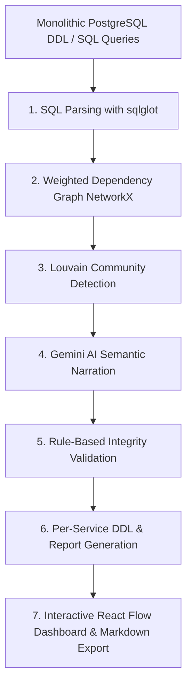

# 🧬 SchemaMorph AI

> **Intelligent Monolith-to-Microservices Database Decomposition Platform**  
> Analyze monolithic PostgreSQL schemas and discover natural, production-ready microservice boundaries using deterministic graph algorithms and Google Gemini AI.

---

## 🌟 Overview

**SchemaMorph AI** tackles a really tough problem: how do you safely break down a massive legacy monolithic database into clean, independently deployable microservices?

Instead of relying purely on black-box LLM magic or spending weeks doing it manually, SchemaMorph AI uses a **hybrid, deterministic-first approach**:
1. **Mathematical Partitioning**: We use `sqlglot`, `NetworkX`, and **Louvain Community Detection** to group your database tables based on actual foreign key relationships and query co-access patterns.
2. **AI Narration**: Google Gemini AI comes in to inspect these deterministic clusters, giving them semantic domain names, explaining the design rationale, and suggesting API boundaries.
3. **Comprehensive Validation**: We automatically double-check the partitions to ensure there are no circular dependencies, orphaned tables, or broken foreign-key constraints.

---

## ✨ What Makes SchemaMorph Unique?

If you've tried using AI to refactor databases before, you've probably noticed that LLMs tend to hallucinate or give you different answers every time you ask. We built SchemaMorph to fix exactly that. 

Instead of just throwing your schema at an LLM and hoping for the best, we rely on **math first and AI second**.

Here's how we approach it differently:

- 🧠 **Math First, AI Second:** We use graph theory (specifically the Louvain Community Detection algorithm) to figure out where the microservice boundaries should be. We only use Gemini AI at the very end to give those clusters human-readable domain names and explain the reasoning.
- 🎯 **100% Reproducible:** Because the heavy lifting is done by deterministic math, you can run the exact same schema through our platform 100 times and you'll get the exact same boundaries 100 times. No random AI chaos.
- 📊 **Workload-Aware:** We don't just look at how your tables are defined. We actually parse your application's `SELECT` and `JOIN` queries. If two tables are constantly queried together, we make sure they stay in the same microservice to avoid crippling network latency.
- 🛡️ **Zero-Hallucination Constraints:** Before any code is generated, our independent validation engine mathematically checks the results to make sure there are no circular dependencies, orphaned tables, or broken foreign keys.

---

## 🚀 Key Features

- 🧩 **Deterministic Graph Clustering**: Foreign key dependencies (weighted 2×) and query co-access patterns (weighted 1×) are modeled as a weighted graph and partitioned via the Louvain modularity algorithm (`random_state=42` for 100% reproducibility).
- 🤖 **AI-Powered Narration**: Gemini AI explains *why* each service exists, generates architectural summaries, and flags queries that cross service boundaries.
- 🛡️ **Zero-Hallucination Integrity Checks**: An independent rule-based validator inspects partition completeness, orphan tables, FK crossings, and cyclic dependencies before generating final outputs.
- 📜 **Per-Service DDL Generation**: Exports clean, isolated, ready-to-deploy SQL schemas for each proposed microservice with foreign keys cleanly decoupled.
- 🕸️ **Interactive React Flow Visualization**: Color-coded, draggable graph visualization with Dagre auto-layout, interactive node exploration, and real-time community highlighting.
- 🎨 **Modern Dark-Mode UI**: Built with React 18, Vite, Tailwind CSS, `@xyflow/react`, and `Three.js` 3D background elements.
- 🔐 **Secure Authentication**: JWT token authentication with bcrypt password hashing and user session management.

---

## 📐 Architecture & 7-Step Pipeline


```mermaid
flowchart TD
    A[Monolithic PostgreSQL DDL / SQL Queries] --> B[1. SQL Parsing with sqlglot]
    B --> C[2. Weighted Dependency Graph NetworkX]
    C --> D[3. Louvain Community Detection]
    D --> E[4. Gemini AI Semantic Narration]
    E --> F[5. Rule-Based Integrity Validation]
    F --> G[6. Per-Service DDL & Report Generation]
    G --> H[7. Interactive React Flow Dashboard & Markdown Export]
```

### Core Pipeline Steps:
1. **DDL Parsing**: Extracts table definitions, columns, primary keys, and foreign keys deterministically.
2. **Query Log Parsing**: Discovers implicit coupling through table co-access frequencies in transaction workloads.
3. **Graph Construction**: Builds an undirected weighted graph where nodes are tables and edge weights represent architectural coupling.
4. **Community Detection**: Computes optimal modularity to discover natural service boundaries without requiring an arbitrary cluster count $k$.
5. **AI Narration**: Gemini assigns domain names (e.g., `Order Service`, `User Service`) and generates technical rationale.
6. **Integrity Validation**: Flags circular service dependencies, missing tables, and broken queries with remediation guidance.
7. **Export & UI**: Generates per-service DDL files, downloadable Markdown reports, and interactive visual representations.

---

## 🛠️ Tech Stack

### Backend
- **Framework**: FastAPI (Python 3.11+) + Uvicorn
- **Parsing**: `sqlglot` (PostgreSQL dialect parser)
- **Graph & Algorithms**: `networkx`, `python-louvain`
- **AI / LLM**: Google Gemini 1.5 Flash via LangChain / Google GenAI SDK
- **Database & Auth**: SQLite / Supabase PostgreSQL (SQLAlchemy 2.0 ORM), `python-jose` (JWT), `passlib` (bcrypt)
- **Validation**: Pydantic v2

### Frontend
- **Framework**: React 18 + Vite
- **Styling**: Tailwind CSS
- **Graph Visualization**: `@xyflow/react` (React Flow) + `@dagrejs/dagre` layout
- **3D Graphics & FX**: `Three.js`, `@react-three/fiber`, `@react-three/drei`
- **State Management**: Zustand
- **UI Components**: `react-hot-toast`, `react-syntax-highlighter`, `recharts`, `lucide-react` (via shadcn)
- **Routing & HTTP**: `react-router-dom` v7, `axios`

---

## 📁 Directory Structure

```
SchemaMorph-AI/
├── backend/
│   ├── app/
│   │   ├── ai/               # Gemini AI engine and prompt templates
│   │   │   ├── engine.py
│   │   │   └── prompts.py
│   │   ├── api/              # FastAPI routers
│   │   │   └── v1/
│   │   │       ├── analysis.py
│   │   │       ├── auth.py
│   │   │       ├── queries.py
│   │   │       ├── router.py
│   │   │       └── schema.py
│   │   ├── core/             # JWT security and configuration
│   │   │   └── security.py
│   │   ├── graph/            # Graph builder & Louvain clustering
│   │   │   ├── builder.py
│   │   │   └── clusterer.py
│   │   ├── models/           # SQLAlchemy DB models & Pydantic schemas
│   │   │   ├── database.py
│   │   │   └── schemas.py
│   │   ├── parsers/          # sqlglot DDL and query parsers
│   │   │   ├── query_parser.py
│   │   │   └── schema_parser.py
│   │   ├── reports/          # Markdown report & DDL generator
│   │   │   └── generator.py
│   │   ├── validation/       # Cycle, orphan, and FK integrity validator
│   │   │   └── validator.py
│   │   └── main.py           # FastAPI application entry point
│   ├── requirements.txt      # Python dependencies
│   └── run.py                # Local server runner
│
├── frontend/
│   ├── src/
│   │   ├── api/              # Axios API client & auth interceptor
│   │   ├── components/       # GraphView, ServicePanel, QueryDiff, StatsBar
│   │   │   └── ui/
│   │   │       └── skiper-ui/ # Animated UI components (@skiper-ui/skiper40)
│   │   ├── lib/              # Utility helpers (cn / clsx / tailwind-merge)
│   │   ├── pages/            # Landing, Login, Register, Upload, Dashboard, History, Team, ProfileSettings
│   │   │   ├── Dashboard.jsx
│   │   │   ├── History.jsx
│   │   │   ├── Landing.jsx
│   │   │   ├── Login.jsx
│   │   │   ├── ProfileSettings.jsx
│   │   │   ├── Register.jsx
│   │   │   ├── Team.jsx
│   │   │   └── Upload.jsx
│   │   ├── store/            # Zustand auth and analysis state stores
│   │   ├── App.jsx           # Application routes and protected routing
│   │   └── main.jsx          # React DOM root
│   ├── components.json       # Shadcn UI configuration
│   ├── jsconfig.json         # Path alias (@/*) configuration
│   ├── package.json          # Node dependencies & build scripts
│   ├── tailwind.config.js    # Tailwind theme & animation extensions
│   └── vite.config.js        # Vite build & development proxy setup
│
├── docker-compose.yml        # Multi-container local orchestration
└── README.md
```

---

## ⚡ Getting Started

### Prerequisites
- **Python**: 3.11 or higher
- **Node.js**: 18.x or higher (and `npm`)
- **Gemini API Key**: Free at [Google AI Studio](https://aistudio.google.com)

---

### 1. Backend Setup

```bash
# Navigate to backend directory
cd backend

# Create and activate a virtual environment
# On Windows:
python -m venv venv
.\venv\Scripts\activate

# On macOS/Linux:
python3 -m venv venv
source venv/bin/activate

# Install dependencies
pip install -r requirements.txt

# Create .env file and set your credentials
# GEMINI_API_KEY="your-google-ai-api-key"
# SECRET_KEY="your-random-secret-key"
```

Start the backend server:
```bash
python run.py
# Server running at http://localhost:8000
# OpenAPI Swagger docs at http://localhost:8000/docs
```

---

### 2. Frontend Setup

```bash
# Navigate to frontend directory
cd frontend

# Install Node modules
npm install

# Start Vite development server
npm run dev
# Application running at http://localhost:5173
```

---

## 🔌 API Reference

| Method | Endpoint | Description |
|---|---|---|
| `POST` | `/api/v1/auth/register` | Register a new user account |
| `POST` | `/api/v1/auth/login` | Log in and obtain JWT access token |
| `GET`  | `/api/v1/auth/me` | Fetch authenticated user profile |
| `POST` | `/api/v1/upload-schema` | Upload raw SQL DDL file or text |
| `POST` | `/api/v1/upload-queries` | Attach sample query logs to session |
| `POST` | `/api/v1/analyze` | Execute complete 7-step decomposition pipeline |
| `GET`  | `/api/v1/session/{id}` | Retrieve cached session results & partition data |
| `GET`  | `/api/v1/projects` | List all saved analysis projects |
| `DELETE` | `/api/v1/projects/{id}` | Delete a saved analysis project |

---

## 🧪 Testing

### ✅ Automated Test Suite Status

The project includes comprehensive test coverage with a **100% pass rate** on the backend validation pipelines.

✅ **All Tests & Flows Passed — Everything is Working**

**Backend Tests: 92/92 PASSED** ✅

| Test Suite | Tests | Status |
|---|---|---|
| Integration - API Pipeline (upload, analyze, queries, health, DoD) | 14 | ✅ All passed |
| Unit - Query Parser | 10 | ✅ All passed |
| Unit - Schema Parser (basic + root) | 11 | ✅ All passed |
| Unit - AI Engine (fallback, mocked LLM) | 7 | ✅ All passed |
| Unit - Graph Builder (build, cluster, serialize, summary) | 17 | ✅ All passed |
| Unit - Schema Parser (detailed: FK, edge cases, graph, large) | 33 | ✅ All passed |

### 🌐 End-to-End Browser Workflows

All critical user flows have been verified via browser E2E testing:
- ✅ **Authentication:** Secure Signup and Login with JWT generation and protected routing.
- ✅ **Schema Parsing:** Successfully uploads, parses, and identifies tables, primary keys, and foreign keys from raw SQL.
- ✅ **Query Analysis:** Parses read/write patterns and cross-boundary access from provided workload queries.
- ✅ **Decomposition Engine:** Successfully generates interactive Graph views, Microservice proposals, and target isolated DDL schemas.

### 🏃 How to Run Tests

**Backend Unit & Integration Tests**
```bash
cd backend
# Activate virtual environment
.\venv\Scripts\activate  # Windows
# source venv/bin/activate # macOS/Linux

pytest tests/ -v
```

**Frontend Build Verification**
```bash
cd frontend
npm run build
```

---

## 👥 Authors & Team

- **Raghuraj Pratap Rajpoot** — *Lead & Architect* (Graph analysis engine, AI pipeline, backend architecture)
- **Samridhi Singh** — *Frontend Engineer* (React Flow visualization, UI design, Zustand state management)
- **Samridhi Jaiswal** — *Backend Engineer* (SQL parsing, database schema, validation pipeline)

---

## 📄 License

This project is licensed under the MIT License — see the LICENSE file for details.
